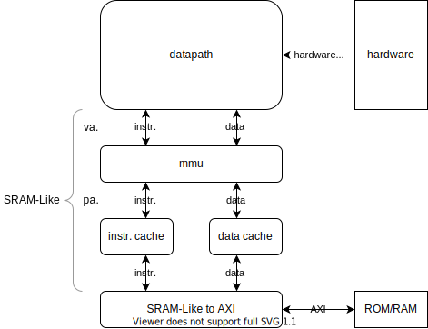

# NaiveMIPS

重庆大学硬件综合设计项目。

## 整体架构

其中，Datapath与MMU之间使用虚拟地址，MMU与Cache之间和Cache与SRAM-Like-AXI桥之间使用物理地址，以上三者均使用SRAM-Like接口。而CPU整体对外使用AXI接口，并接受硬件中断。

## 数据通路

其中蓝色线代表地址，绿色线代表数据，紫色线代表指令，黄色线代表控制信号，红色线代表异常信号。各线的代号格式为*阶段.类型.标号*，如IF.A.1表示IF阶段第一条地址线，MM.E.4表示MM阶段第四条异常信号线。

| 代号   | 含义                                                     |
| ------ | -------------------------------------------------------- |
| IF.A.1 | （可能存在的）异常处理入口地址                           |
| IF.A.2 | （可能存在的）分支跳转目标地址                           |
| IF.A.3 | 指令地址                                                 |
| IF.C.1 | PC寄存器控制信号                                         |
| IF.C.2 | 指令总线发出的停顿请求                                   |
| ID.A.1 | 指令地址                                                 |
| ID.D.1 | 来自之后阶段的前推数据                                   |
| ID.D.2 | （可能的存在的）读寄存器数据                             |
| ID.D.3 | 运算器操作数                                             |
| ID.D.4 | 返回地址（作为操作数存在）                               |
| ID.I.1 | 当前指令                                                 |
| ID.C.1 | 指令解码得到的控制信号                                   |
| ID.E.1 | 指令总线的AdEL，以及寄存器提供的当前中断（考虑屏蔽之后） |
| EX.A.1 | 运算器生成的，访存的地址                                 |
| EX.D.1 | 运算器操作数                                             |
| EX.D.2 | 运算器生成的，访存或写回寄存器的数据                     |
| EX.D.3 | 运算器与CP0寄存器堆的交互                                |
| EX.C.1 | 指令解码得到的控制信号                                   |
| EX.C.2 | 多周期运算器的停顿信号                                   |
| EX.E.1 | 指令总线的AdEL，以及寄存器提供的当前中断（考虑屏蔽之后） |
| EX.E.2 | 内陷指令、未实现指令和溢出错误                           |
| MM.A.1 | 访存的地址                                               |
| MM.A.2 | 指令地址                                                 |
| MM.A.3 | 异常处理报告控制器，异常处理程序入口的地址               |
| MM.D.1 | 访存或写回寄存器的数据                                   |
| MM.D.2 | 异常处理写入CP0的数据                                    |
| MM.C.1 | 指令解码得到的控制信号                                   |
| MM.C.2 | 数据总线发出的停顿请求                                   |
| MM.E.1 | 指令总线的AdEL，以及寄存器提供的当前中断（考虑屏蔽之后） |
| MM.E.2 | 内陷指令、未实现指令和溢出错误                           |
| MM.E.3 | 数据总线的AdEL，AdES                                     |
| WB.D.1 | 写回寄存器的数据的可能来源之一（来自运算器）             |
| WB.D.2 | 写回寄存器的数据的可能来源之二（来自访存结果）           |
| WB.D.3 | 写回寄存器的数据                                         |
| WB.C.1 | 指令解码得到的控制信号                                   |

### 通用路径

1. IF：pc根据使能信号（IF.C.1）、错误处理入口地址（IF.A.1）、分支指令目标地址（IF.A.2）、当前pc地址（IF.A.3），计算下一条指令的地址（IF.A.3），送至指令总线；
   - 回路IF.A.3实际上在pc内部。
2. decode根据指令总线返回的指令（ID.I.1），计算解码相关信息（ID.C.1）。

### 简单运算指令（包括逻辑运算指令、移位指令、数据移动指令、算数运算指令）

1. ID：exesrc合并前推数据（ID.D.1）、通用寄存器堆（ID.D.2）、立即数（ID.C.1），产生运算器操作数（ID.D.3）；
2. EX：execute和complex根据操作数（EX.D.1）、运算码（EX.C.1），计算结果（EX.D.2），可能产生溢出（EX.E.2），可能导致流水线停顿（EX.C.2）；
3. MM：不做处理；
4. WB：wb根据计算结果（WB.D.1）、要写的寄存器号（WB.C.1），写回寄存器（WB.D.3）。

### 分支跳转指令

1. ID：exesrc合并前推数据（ID.D.1）、通用寄存器堆（ID.D.2）、立即数（ID.C.1），产生条件比较操作数（ID.D.3）；
2. ID：branch根据指令（ID.I.1）、条件比较操作数（ID.D.3），计算条件跳转目标地址（IF.A.2），计算返回地址（ID.D.4）；
   - 由于延迟槽的存在，不需要停顿。
3. ID：exesrc合并返回地址（ID.D.4）得到运算器操作数（ID.D.3）；
   - 只有beq和bne需要两个条件比较操作数，但这两条指令不要求保存返回地址，因此ID.D.3中的两条数据线总是够用的。
4. EX：不做处理；
5. MM：不做处理；
6. WB：wb根据返回地址（WB.D.1）、要写的寄存器号（WB.C.1），写回寄存器（WB.D.3）；

### 访存指令

1. ID：exesrc合并前推数据（ID.D.1）、通用寄存器堆（ID.D.2）、立即数（ID.C.1），产生运算器操作数（ID.D.3）；
2. EX：execute根据操作数（EX.D.1）、运算码（EX.C.1），计算访存地址（EX.A.1），可能计算访存数据（EX.D.2）；
3. MM：将访存地址（MM.A.1）、访存数据（MM.D.1）、访存使能信号（MM.C.1）送至数据总线；
4. WB：wb根据数据总线返回的数据（WB.D.2）、要写的寄存器号（WB.C.1），写回寄存器（WB.D.3）。

### 内陷指令（包括eret）

1. ID：无额外处理；
2. EX：execute根据操作码（EX.C.1），生成错误信号（EX.E.2）；
3. MM：参见错误处理一节；
4. WB：不做处理。

### 特权指令（不包括eret）

1. ID：exesrc合并前推数据（ID.D.1）、通用寄存器堆（ID.D.2），产生运算器操作数（ID.D.3）；
2. EX：execute根据操作数（EX.D.1）、运算码（EX.C.1），读写CP0寄存器（EX.D.3）；
3. MM：不做处理；
4. WB：不做处理。

### 错误处理

1. MM：except汇总所有错误信息（MM.E.1、MM.E.2、MM.E.3），根据指令地址（MM.A.2），生成错误处理入口地址（MM.A.3）并报告处理器，设置CP0寄存器（MM.D.2）；
   - 对于eret指令，需要获得CP0.EPC寄存器（MM.D.2），作为错误处理入口地址（MM.A.3）。
2. 处理器将错误处理入口地址（MM.A.3）反馈给pc（IF.A.1），并刷新流水线。
   - 错误指令之前指令此时已到达WB阶段并提交，因此可以安全地刷新整条流水线。

### 数据前推

1. ID：接受来自之后阶段的前推数据（ID.D.1）；
2. EX：前推运算器计算结果（EX.D.2）；
3. MM：前推运算器计算结果（MM.D.1）；
4. WB：数据直接穿透寄存器堆（WB.D.3、ID.D.2）。

## 模块设计

### 顶层模块

| 模块名称         | 源文件路径                  | 文档路径         | 主要功能           | 负责人       |
| ---------------- | --------------------------- | ---------------- | ------------------ | ------------ |
| mips             | src/mips/mips.v             | doc/mips/mips.md | 封装MIPS整体功能   |              |
| sram_like_to_axi | src/mips/sram_like_to_axi.v |                  | 转换SRAM-Like至AXI | 实验环境提供 |
| mmu              | src/mips/mmu.v              | doc/mips/mmu.md  | 实现地址映射       |              |
| bus              | src/mips/bus.v              | doc/mips/bus.md  | 提供总线接口       |              |

### 缓存模块

| 模块名称      | 源文件路径               | 文档路径                  | 主要功能                   | 负责人 |
| ------------- | ------------------------ | ------------------------- | -------------------------- | ------ |
| cache         | src/mips/cache/cache.v      | doc/mips/cache/cache.md   | 实现缓存整体              |        |
| cache_set     | src/mips/cache/cache_set.v  | doc/mips/cache/cache_set.md | 实现缓存组           |        |
| cache_line    | src/mips/cache/cache_line.v | doc/mips/cache/cache_line.md | 实现缓存行          |        |

### 数据通路

| 模块名称 | 源文件路径                     | 文档路径                        | 主要功能         | 负责人 |
| -------- | ------------------------------ | ------------------------------- | ---------------- | ------ |
| datapath | src/mips/datapath/datapath.v   | doc/mips/datapath/datapath.md   | 实现数据通路     |        |
| control  | src/mips/datapath/controller.v | doc/mips/datapath/controller.md | 控制流水线       |        |
| gpr      | src/mips/datapath/gpr.v        | doc/mips/datapath/gpr.md        | 实现通用寄存器堆 |        |
| cp0      | src/mips/datapath/cp0.v        | doc/mips/datapath/cp0.md        | 实现CP0寄存器堆  |        |

#### IF阶段

| 模块名称 | 源文件路径                         | 文档路径 | 主要功能     | 负责人 |
| -------- | ---------------------------------- | -------- | ------------ | ------ |
| pc       | src/mips/datapath/if/pc.v      | doc/mips/datapath/if/pc.md      | 实现PC寄存器     |        |

#### ID阶段

| 模块名称 | 源文件路径                | 文档路径                   | 主要功能     | 负责人 |
| -------- | ------------------------- | -------------------------- | ------------ | ------ |
| id       | src/mips/datapath/id/id.v | src/mips/datapath/id/id.md | 实现译码阶段 |        |
| branch   | src/mips/datapath/id/branch.v  | doc/mips/datapath/id/branch.md  | 实现跳转处理     |        |
| decode   | src/mips/datapath/id/decode.v  | doc/mips/datapath/id/decode.md  | 实现指令译码     |        |
| exesrc | src/mips/datapath/id/exesrc.v | doc/mips/datapath/id/exesrc.md | 准备运算器的操作数 ||

#### EX阶段

| 模块名称 | 源文件路径                         | 文档路径                   | 主要功能     | 负责人 |
| -------- | ---------------------------------- | -------------------------- | ------------ | ------ |
| ex       | src/mips/datapath/ex/ex.v          | doc/mips/datapath/ex/ex.md | 实现执行阶段 |        |
| complex  | src/mips/datapath/ex/complex.v | doc/mips/datapath/ex/complex.md | 实现多周期运算器 |        |
| execute  | src/mips/datapath/ex/execute.v | doc/mips/datapath/ex/execute.md | 实现单周期运算器 |        |

#### MM阶段

| 模块名称 | 源文件路径                     | 文档路径                        | 主要功能         | 负责人 |
| -------- | ------------------------------ | ------------------------------- | ---------------- | ------ |
| except   | src/mips/datapath/mm/except.v  | doc/mips/datapath/mm/except.md  | 实现异常处理     |        |

#### WB阶段

| 模块名称 | 源文件路径                     | 文档路径                        | 主要功能         | 负责人 |
| -------- | ------------------------------ | ------------------------------- | ---------------- | ------ |
| wb       | src/mips/datapath/wb/wb.v      | doc/mips/datapath/wb/wb.md      | 实现写回阶段     |        |
